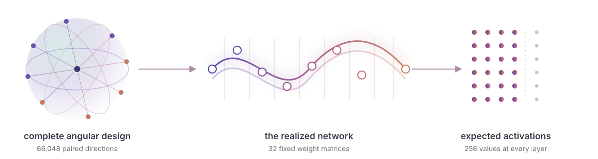

# ARC White-Box Estimation Challenge 2026

Phase 1 algorithmic contribution for AIcrowd submission **327801**

<p align="center">
  
</p>

This repository preserves the final explanatory report, the exact submitted
archive, its unpacked implementation, the principal validation receipts,
pinned environment locks, and the surviving experiment ledger.

## Phase 1 result

| Measure | Recorded value |
| --- | --- |
| Public adjusted score | `1.1432995022695342e-7` |
| Public final-layer MSE | `2.206820236239082e-7` |
| Mean effective compute | `140,703,286,543.49994` |
| Public rows completed | `50 / 50` |
| Complete grader run | `100 / 100` with zero failures |

The official receipt is available in
[`evidence/remote/submission_327801_final.json`](evidence/remote/submission_327801_final.json).
The exact submission archive has SHA-256 digest
`f6824fa6bbc79368e358da847b1aca9597b0be79ee1afbde10f5b8adedb059ed`.

## Release map

- [`report/ARC-White-Box-Phase1-Algorithmic-Contribution-327801.pdf`](report/ARC-White-Box-Phase1-Algorithmic-Contribution-327801.pdf)
  is the final algorithmic-contribution report.
- [`submission/`](submission/) contains the exact AIcrowd archive and its
  unpacked implementation.
- [`evidence/`](evidence/) contains the remote receipt, exact Mini100 replay,
  post-seal score, packaging provenance, and quiet physical controls.
- [`environment/`](environment/) pins the FlopScope 0.10.0 and WhestBench
  0.14.0 project metadata and lockfiles.
- [`method/`](method/) records the challenge, estimator, and validation
  conventions.
- [`ledger/`](ledger/) contains the early research record and 581 later
  preregistration or verdict documents. Negative results remain part of the
  contribution.

## Submitted package

The authoritative package is
[`submission/submission_327801.tar.gz`](submission/submission_327801.tar.gz).
It contains three regular files.

```text
estimator.py
vendor_modules.whestdata
manifest.json
```

The same files appear under [`submission/extracted/`](submission/extracted/)
for direct inspection. The release can be verified with the following
commands.

```bash
sha256sum -c SHA256SUMS
tar -tzf submission/submission_327801.tar.gz
```

A complete benchmark additionally requires the challenge datasets and the
released evaluator infrastructure. Those large datasets are not redistributed
here.

## Evidence convention

- **Remote** records were returned by AIcrowd.
- **Measured whole** records cover a complete estimator execution.
- **Broad statistical** records score frozen predictions on a named network
  bank.
- **Component** records isolate one subgraph or mechanism.
- **Projection** records combine previously measured quantities
  arithmetically.

## Privacy boundary

This directory was assembled from an explicit whitelist. It excludes working
conversations, agent transcripts and handoffs, credentials, cookies,
environment files, personal download paths, caches, and editable report
sources. Ledger records excluded by the safety scan were not copied.

## License

See [`LICENSE`](LICENSE) and
[`THIRD_PARTY_NOTICES.md`](THIRD_PARTY_NOTICES.md).
